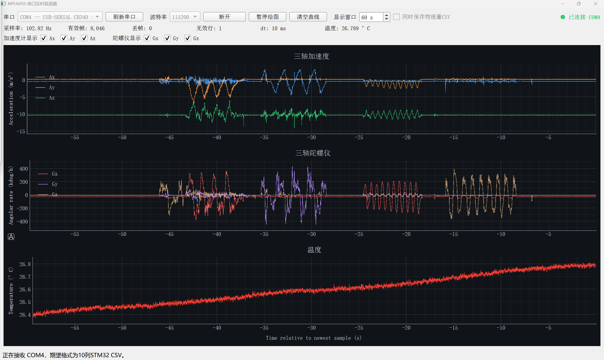

# STM32 MPU6050 Allan Toolkit

[中文](README.md) | [English](README_EN.md)

基于 STM32F103 和 MPU6050 的静态数据采集、实时监视、数据解码与 Allan
偏差分析工具。项目面向低成本 IMU 随机误差标定及 GNSS/INS 实验。

## 功能

- MPU6050 `DATA_RDY` 中断触发的约 100 Hz 六轴采集；
- STM32通过USB-TTL输出带采样序号和时间戳的CSV；
- PyQt5实时显示三轴加速度、三轴角速度和温度；
- `Ax/Ay/Az/Gx/Gy/Gz` 独立勾选，支持单轴查看；
- Qt界面支持中文/English即时切换并记住语言选择；
- 实时保存解码后的物理量CSV；
- 原始计数离线转换为 `m/s²`、`deg/h` 和 `℃`；
- 计算重叠Allan偏差；
- 自动识别ARW/VRW、BI、RRW和Rate Ramp候选区间；
- 输出温度相关性、稳定性曲线、参数CSV和中文判读报告。

## 项目结构

```text
stm32-mpu6050-allan-toolkit/
├─ imu_serial_qt/       Qt实时串口监视器
└─ stm32_imu_test/      STM32固件、解码和Allan分析工具
```

详细说明：

- [STM32采集与Allan分析](stm32_imu_test/README_Allan.md)
- [Qt实时串口监视器](imu_serial_qt/README.md)
- [Allan相关知识总结](stm32_imu_test/Allan方差知识总结.md)
- [English: acquisition and Allan analysis](stm32_imu_test/README_Allan_EN.md)

## 硬件

- STM32F103C8T6开发板；
- MPU6050 / GY-521模块；
- ST-LINK V2；
- CH340或其他3.3 V TTL串口模块。

核心接线：

| MPU6050 / 串口 | STM32F103 |
|---|---|
| SDA | PB7 |
| SCL | PB6 |
| INT | PB0 |
| USB-TTL RX | PA9 / USART1_TX |
| GND | GND（所有设备共地） |

## 数据流

```text
MPU6050 --I2C/DATA_RDY--> STM32 --UART CSV--> USB-TTL --> PC
                                                            ├─ Qt实时显示/保存
                                                            └─ Allan离线分析
```

## 程序演示

Qt串口监视器可实时显示三轴加速度、三轴角速度和温度，支持各轴独立勾选、
采样率与丢帧统计、暂停绘图以及同步保存物理量CSV。



## Allan分析示例

下图展示六轴IMU陀螺仪和加表的Allan偏差及随机误差参数识别结果，包括
ARW/VRW、BI、RRW与Rate Ramp。


## 快速开始

### 1. 运行Qt监视器

安装Python依赖：

```powershell
python -m pip install -r imu_serial_qt\requirements.txt
```

启动：

```powershell
python imu_serial_qt\imu_serial_qt.py
```

也可以在Windows中双击：

```text
imu_serial_qt\run_imu_serial_qt.bat
```

刷新并选择USB-TTL对应的实际COM端口，波特率选择115200。串口不能同时被
串口助手、Qt监视器和其他采集程序占用。

### 2. 数据格式

STM32原始输出：

```text
sample,time_ms,dt_ms,ax_raw,ay_raw,az_raw,temp_raw,gx_raw,gy_raw,gz_raw
```

Qt保存或离线解码后的物理量格式：

```text
sample,time_s,dt_s,ax_m_s2,ay_m_s2,az_m_s2,temp_deg_c,gx_deg_h,gy_deg_h,gz_deg_h
```

### 3. Allan分析

`allan_noise_identification.py`只接受上述物理量CSV。示例：

```powershell
cd stm32_imu_test

python tools\allan_noise_identification.py `
  decoded_data\your_recording_physical.csv `
  --rate 100 `
  --skip-minutes 30 `
  --points 90 `
  --output allan_results\your_recording_result
```

程序生成：

- `allan_deviation.png`：加速度计和陀螺仪双图总览；
- `allan_identification.png`：六轴噪声区间识别图；
- `stability_overview.png`：60秒均值与温度稳定性图；
- `allan_parameters.csv`：随机误差参数及拟合信息；
- `allan_deviation.csv`：各τ点的六轴Allan偏差；
- `随机误差判读报告.md`：中文分析报告。

## STM32构建与烧录

固件使用CMake、GNU Arm Embedded Toolchain和STM32CubeProgrammer。完整接线、
构建和烧录步骤见[README_Allan.md](stm32_imu_test/README_Allan.md)。

## 实验数据

长时间IMU采集文件通常为数百MB，不随Git仓库发布。仓库通过`.gitignore`
排除了原始CSV、解码CSV、分析快照和生成结果。用户可按照文档自行采集，或将
数据发布到Zenodo、OSF等独立数据存储平台后在此处添加下载链接。

## 注意事项

- Allan长时间尺度容易受到温度、供电和环境振动影响；
- 自动识别结果是候选值，应通过重复实验和温控实验验证；
- BI不能直接平方后作为卡尔曼滤波每步过程噪声；
- 本项目用于实验和研究，不适用于未经验证的安全关键系统。

## License

本项目采用[MIT License](LICENSE)。第三方代码仍遵循其各自的许可证声明。
