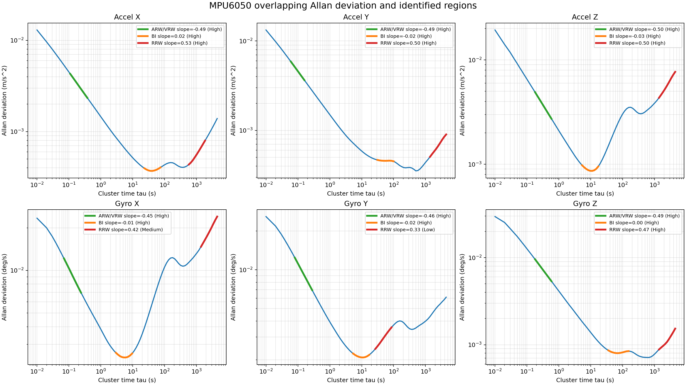

# STM32 MPU6050 Acquisition and Allan Variance Toolkit

English | [中文](README.md)

This repository provides an end-to-end MPU6050 workflow: STM32F103 acquisition, a Qt serial monitor and recorder, CSV decoding, and Allan-variance-based stochastic-noise identification.

## Repository layout

    firmware/                 STM32F103 firmware
    host/                     Qt real-time monitor and EXE packaging files
    tools/                    Serial capture, decoding, and Allan analysis
    data/raw/                 Raw integer CSV files (local, not committed)
    data/decoded/             Physical-unit CSV files (local, not committed)
    data/allan_results/       Allan results (local, not committed)
    docs/                     Notes and documentation images

Detailed guides:

- [Firmware](firmware/README_EN.md)
- [Qt serial monitor](host/README_EN.md)
- [Data tools and Allan analysis](tools/README_EN.md)
- [Chinese Allan variance notes](docs/Allan方差知识总结.md)

## Hardware wiring

The verified wiring is shown below. Power the GY-521 from 3.3 V.

| Device pin | STM32F103C8T6 | Purpose |
| --- | --- | --- |
| GY-521 VCC | 3.3V | IMU power |
| GY-521 GND | GND | Common ground |
| GY-521 SCL | PB6 | I2C1_SCL |
| GY-521 SDA | PB7 | I2C1_SDA |
| GY-521 INT | PB0 | Data-ready interrupt |
| USB-TTL RX | PA9 | Receives STM32 USART1_TX |
| USB-TTL GND | GND | Common ground |

ST-LINK flashes and debugs the firmware. USB-TTL carries measurement data to the computer. They may remain connected at the same time.

  

## Build and run from scratch

### 1. Install software

- STM32CubeIDE for Visual Studio Code, or CMake, Ninja, and the GNU Arm Embedded Toolchain
- STM32CubeProgrammer and the ST-LINK driver
- Python 3.10 or later

Install Python dependencies from the repository root:

    D:\Anaconda3\python.exe -m pip install -r host\requirements.txt
    D:\Anaconda3\python.exe -m pip install -r tools\requirements.txt

Replace the Python path if your interpreter is installed elsewhere.

### 2. Build the firmware

Run in PowerShell:

    $ninjaDir = "$env:LOCALAPPDATA\stm32cube\bundles\ninja\1.13.2+st.1\bin"
    $gccDir = "$env:LOCALAPPDATA\stm32cube\bundles\gnu-tools-for-stm32\14.3.1+st.2\bin"
    $env:Path = "$ninjaDir;$gccDir;$env:Path"
    Push-Location firmware
    cmake --preset Release
    cmake --build --preset Release
    Pop-Location

Outputs are written to firmware/build/Release/. Adjust the versioned tool directories to match your installation.

### 3. Flash the firmware

Connect ST-LINK SWDIO, SWCLK, GND, and 3.3V, then flash the generated ELF file with STM32CubeProgrammer. Command-line example:

    & "$env:LOCALAPPDATA\stm32cube\bundles\programmer\2.23.0\bin\STM32_Programmer_CLI.exe" -c port=SWD mode=UR reset=HWrst -w "firmware\build\Release\stm32_imu_test.elf" -v -rst

After reset or power-up, acquisition starts automatically and PA9 transmits the data. No start command from the PC is required.

### 4. Run the Qt monitor

    D:\Anaconda3\python.exe host\imu_serial_qt.py

You may also double-click host/run_imu_serial_qt.bat. Select the USB-TTL port, choose 115200 baud, and click Connect. When Save physical-unit CSV is enabled, files default to data/decoded/.

### 5. Capture from the command line

Capture 12 hours from COM3 while directly converting frames to the physical-unit format accepted by the Allan tool:

    D:\Anaconda3\python.exe tools\capture_serial.py COM3 --hours 12

Files default to data/decoded/. To also retain raw integer frames:

    D:\Anaconda3\python.exe tools\capture_serial.py COM3 --hours 12 --raw-output data\raw\mpu6050_static_raw.csv

### 6. Run Allan analysis

    D:\Anaconda3\python.exe tools\allan_noise_identification.py data\decoded\your_data.csv --rate 100 --skip-minutes 30 --points 90

Results default to data/allan_results/input_name_noise/. For useful long-term estimates, keep the IMU stationary for several hours, avoid vibration, and minimize temperature changes.

## Data formats

The STM32 emits 10-column raw frames:

    sample,time_ms,dt_ms,ax_raw,ay_raw,az_raw,temp_raw,gx_raw,gy_raw,gz_raw

Decoded files and the Allan tool use:

    sample,time_s,dt_s,ax_m_s2,ay_m_s2,az_m_s2,temp_deg_c,gx_deg_h,gy_deg_h,gz_deg_h

## Screenshots

## Generated files and experimental data

Firmware build files, PyInstaller build/dist directories, Python caches, and experimental files below data/ are excluded by .gitignore. Empty data directories are retained through .gitkeep. Generated files can be deleted and recreated from the commands above.

## License

This project is licensed under the [MIT License](LICENSE).
