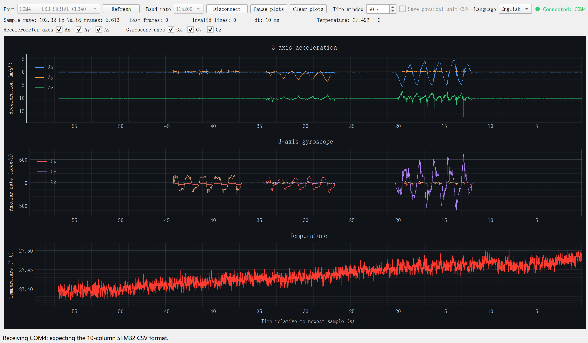

# STM32 MPU6050 Allan Toolkit

[中文](README.md) | [English](README_EN.md)

An STM32F103 and MPU6050 toolkit for static data acquisition, real-time
monitoring, raw-data decoding, and Allan deviation analysis. It is intended for
low-cost IMU stochastic-error characterization and GNSS/INS experiments.

## Features

- Approximately 100 Hz, MPU6050 `DATA_RDY` interrupt-driven 6-axis acquisition;
- timestamped CSV output from STM32 through a USB-to-TTL adapter;
- PyQt5 plots for 3-axis acceleration, angular rate, and temperature;
- independent `Ax/Ay/Az/Gx/Gy/Gz` selection, including single-axis views;
- Chinese/English UI switching with persistent language selection;
- real-time storage of decoded physical-unit CSV data;
- raw-count conversion to `m/s²`, `deg/h`, and `°C`;
- overlapping Allan deviation computation;
- automatic candidate-region identification for ARW/VRW, BI, RRW, and rate ramp;
- temperature correlation, stability plots, parameter CSV, and an interpretation report.

## Repository layout

```text
stm32-mpu6050-allan-toolkit/
├─ imu_serial_qt/       Qt real-time serial monitor
└─ stm32_imu_test/      STM32 firmware, decoder, and Allan-analysis tools
```

Documentation:

- [Acquisition and Allan-analysis guide](stm32_imu_test/README_Allan_EN.md)
- [Qt serial monitor](imu_serial_qt/README_EN.md)
- [Chinese Allan knowledge notes](stm32_imu_test/Allan方差知识总结.md)

## Hardware

The following photo shows an example physical setup using an STM32F103,
GY-521 (MPU6050), ST-LINK, and USB-to-TTL adapter. Use the pin table below as
the authoritative wiring reference.


- STM32F103C8T6 development board;
- MPU6050/GY-521 module;
- ST-LINK V2;
- CH340 or another 3.3 V USB-to-TTL serial adapter.

Main connections:

| MPU6050 / serial signal | STM32F103 |
|---|---|
| VCC | 3.3 V |
| GND | GND |
| SDA | PB7 |
| SCL | PB6 |
| INT | PB0 |
| USB-to-TTL RX | PA9 / USART1_TX |
| USB-to-TTL GND | GND shared by all devices |

The verified setup for this project powers `GY-521 VCC` from the STM32 `3.3 V`
pin. Keep this 3.3 V connection and do not change the MPU6050 VCC connection to
5 V. Only RX and GND are required on the USB-to-TTL adapter. If the STM32 is
already powered through USB or ST-LINK, do not connect the adapter VCC pin.

## Data flow

```text
MPU6050 --I2C/DATA_RDY--> STM32 --UART CSV--> USB-to-TTL --> PC
                                                            ├─ Qt display/storage
                                                            └─ offline Allan analysis
```

## Application demo

The Qt monitor displays acceleration, angular rate, and temperature. It also
reports sample rate, lost frames, and malformed lines, and can save decoded data.



## Allan-analysis example

The following figure shows Allan deviation and automatically selected stochastic
error regions for all six axes: ARW/VRW, BI, RRW, and rate ramp.


## Quick start

### 1. Run the Qt monitor

Install the Python dependencies:

```powershell
python -m pip install -r imu_serial_qt\requirements.txt
```

Start the application:

```powershell
python imu_serial_qt\imu_serial_qt.py
```

On Windows, you can also double-click:

```text
imu_serial_qt\run_imu_serial_qt.bat
```

Select the actual COM port used by the USB-to-TTL adapter and set the baud rate
to 115200. A serial port cannot be shared by the Qt monitor, another serial
terminal, and a logging script.

Use the **Language** list in the upper-right corner to select Chinese or English.
The setting is retained for the next launch.

### 2. Data formats

Raw STM32 output:

```text
sample,time_ms,dt_ms,ax_raw,ay_raw,az_raw,temp_raw,gx_raw,gy_raw,gz_raw
```

Physical-unit data saved by Qt or produced by the offline decoder:

```text
sample,time_s,dt_s,ax_m_s2,ay_m_s2,az_m_s2,temp_deg_c,gx_deg_h,gy_deg_h,gz_deg_h
```

### 3. Allan analysis

`allan_noise_identification.py` accepts the physical-unit format above:

```powershell
cd stm32_imu_test

python tools\allan_noise_identification.py `
  decoded_data\your_recording_physical.csv `
  --rate 100 `
  --skip-minutes 30 `
  --points 90 `
  --output allan_results\your_recording_result
```

The program produces:

- `allan_deviation.png`: combined accelerometer and gyroscope overview;
- `allan_identification.png`: stochastic-error regions for all six axes;
- `stability_overview.png`: 60-second means and temperature stability;
- `allan_parameters.csv`: parameters and fit metadata;
- `allan_deviation.csv`: Allan-deviation values for every cluster time;
- `随机误差判读报告.md`: generated Chinese interpretation report.

## Build and flash the STM32 firmware

The firmware uses CMake, GNU Arm Embedded Toolchain, and STM32CubeProgrammer.
See the [complete English guide](stm32_imu_test/README_Allan_EN.md) for wiring,
building, flashing, acquisition, decoding, and analysis instructions.

## Experimental data

Long-duration IMU recordings are often hundreds of megabytes and are excluded
from Git with `.gitignore`. Raw CSV, decoded CSV, snapshots, and generated results
should be stored separately, or published through a data service such as Zenodo
or OSF if they need to be shared.

## Notes

- Long-cluster-time Allan results are sensitive to temperature, power, and vibration;
- automatic parameter identification returns candidates that should be validated by repeated tests;
- do not use `BI²` directly as the per-step process-noise covariance of a Kalman filter;
- this project is intended for experiments and research, not unvalidated safety-critical systems.

## License

This project is distributed under the [MIT License](LICENSE). Third-party code
remains subject to its own license terms.
