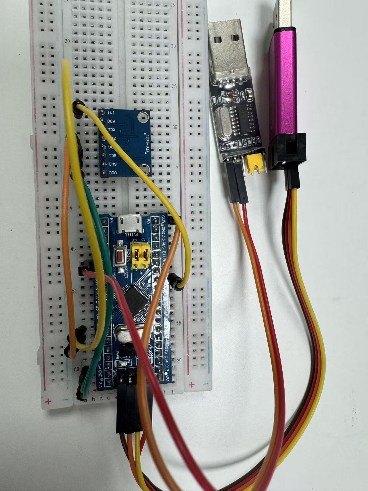

# MPU6050 Static Acquisition and Allan Stochastic-Error Analysis

[中文](README_Allan.md) | [English](README_Allan_EN.md)

This guide covers the complete workflow:

1. connect the MPU6050, STM32, ST-LINK, and USB-to-TTL adapter;
2. build and flash the STM32 acquisition firmware;
3. record static IMU data;
4. decode raw counts into physical units when necessary;
5. run `allan_noise_identification.py` and interpret the stochastic-error parameters.

The former `allan_analysis.py` plotting functionality is already integrated into
`allan_noise_identification.py`, so only the latter is needed for new analyses.

## 1. Project layout

```text
stm32-mpu6050-allan-toolkit/
├─ imu_serial_qt/
│  ├─ imu_serial_qt.py          # Real-time display and physical-unit CSV storage
│  └─ run_imu_serial_qt.bat     # Windows launcher
└─ stm32_imu_test/
   ├─ Src/main.c                # STM32 acquisition firmware
   ├─ data/                     # Raw serial recordings
   ├─ decoded_data/             # Decoded physical-unit recordings
   ├─ allan_results/            # Allan-analysis output
   ├─ tools/capture_serial.py   # Long-duration raw serial logger
   ├─ tools/decode_imu_data.py  # Raw-count decoder
   └─ tools/allan_noise_identification.py
```

The commands below are run from `stm32_imu_test` unless stated otherwise:

```powershell
cd stm32_imu_test
```

## 2. Hardware wiring

| Signal | STM32F103C8T6 | GY-521 / USB-to-TTL |
|---|---|---|
| MPU6050 power | 3.3 V | GY-521 VCC |
| Common ground | GND | GY-521 GND and USB-to-TTL GND |
| I2C clock | PB6 | GY-521 SCL |
| I2C data | PB7 | GY-521 SDA |
| Data-ready interrupt | PB0 | GY-521 INT |
| Serial output | PA9 | USB-to-TTL RXD |

Physical wiring example (use the table above as the pin-level reference):



Important:

- STM32, MPU6050, USB-to-TTL, and ST-LINK must share ground;
- keep `BOOT0` at 0;
- the USB-to-TTL TX pin is not required for one-way acquisition;
- do not power the STM32 from the adapter VCC when it is already powered by USB or ST-LINK;
- connect MPU6050 INT to PB0, or the interrupt-driven acquisition will not run.

The firmware configures MPU6050 `DATA_RDY` as an active-high latched interrupt.
PB0/EXTI0 detects its rising edge. The interrupt handler records the event and
timestamp, while I2C reading and UART output are performed in the main loop.

## 3. Build and flash the STM32 firmware

### 3.1 ST-LINK wiring

```text
ST-LINK SWDIO -> STM32 PA13
ST-LINK SWCLK -> STM32 PA14
ST-LINK GND   -> STM32 GND
```

### 3.2 Build

```powershell
cmake --build --preset Debug
```

The resulting firmware is:

```text
build\Debug\stm32_imu_test.elf
```

### 3.3 Flash

Adjust the STM32CubeProgrammer version in the path if necessary:

```powershell
& "$env:LOCALAPPDATA\stm32cube\bundles\programmer\2.23.0\bin\STM32_Programmer_CLI.exe" `
  -c port=SWD mode=UR reset=HWrst `
  -w "build\Debug\stm32_imu_test.elf" -v -rst
```

`Download verified successfully` confirms that programming and verification
completed successfully.

Current firmware configuration:

- serial output: 115200 bit/s, 8N1;
- output rate: approximately 100 Hz;
- accelerometer range: ±2 g, 16384 LSB/g;
- gyroscope range: ±250 °/s, 131 LSB/(°/s);
- DLPF bandwidth: approximately 42/44 Hz;
- trigger: MPU6050 DATA_RDY to PB0 external interrupt.

## 4. Record static data

Recommendations for an Allan test:

- mount the IMU rigidly on a stable surface;
- do not move it, touch the table, or reconnect wires during acquisition;
- keep it away from fans, vibration sources, and direct sunlight;
- record temperature and minimize HVAC-induced temperature cycling;
- warm up the sensor for 30 minutes;
- 6 hours can provide a preliminary result; 12–24 hours is recommended;
- prevent computer sleep, automatic restart, and USB power saving.

Choose either acquisition method below.

### 4.1 Method A: save physical-unit CSV with the Qt monitor (recommended)

From the repository root, run:

```powershell
python imu_serial_qt\imu_serial_qt.py
```

On Windows, `imu_serial_qt\run_imu_serial_qt.bat` can also be double-clicked.

Procedure:

1. close all other serial monitors and acquisition scripts;
2. click **Refresh**;
3. select the CH340 COM port shown in Windows Device Manager;
4. select 115200 baud;
5. before connecting, enable **Save physical-unit CSV**;
6. click **Connect** and choose the output file;
7. verify that valid frames increase, the rate is near 100 Hz, and lost/invalid counts remain normal;
8. when finished, click **Disconnect** so the CSV stream is flushed and closed.

The **Language** list switches the interface between Chinese and English. The
selection is stored automatically. Qt output is already in the format required
by the Allan tool and does not need decoding.

### 4.2 Method B: save raw counts, then decode them

Replace `COM3` with the actual port:

```powershell
python tools\capture_serial.py COM3 --hours 12
```

Raw serial columns:

```text
sample,time_ms,dt_ms,ax_raw,ay_raw,az_raw,temp_raw,gx_raw,gy_raw,gz_raw
```

Decode the completed recording:

```powershell
python tools\decode_imu_data.py data\mpu6050_static_YYYYMMDD_HHMMSS.csv
```

Output is written to `decoded_data` by default. Conversions are:

```text
acceleration_m_s2 = raw / 16384 × 9.80665
angular_rate_deg_h = raw / 131 × 3600
temperature_deg_c = temp_raw / 340 + 36.53
```

The decoder also creates a 6-axis-plus-temperature overview. Use
`--plot-block-seconds 10` for smoother long-duration plots or `0.1` for detail.

## 5. Allan input format

`allan_noise_identification.py` accepts only decoded physical-unit CSV data with
these exact columns:

```text
sample,time_s,dt_s,ax_m_s2,ay_m_s2,az_m_s2,temp_deg_c,gx_deg_h,gy_deg_h,gz_deg_h
```

| Column | Unit | Meaning |
|---|---|---|
| `sample` | none | monotonically increasing sample number |
| `time_s` | s | accumulated STM32 acquisition time |
| `dt_s` | s | interval from the previous sample |
| `ax/ay/az_m_s2` | m/s² | 3-axis acceleration |
| `temp_deg_c` | °C | MPU6050 internal temperature |
| `gx/gy/gz_deg_h` | °/h | 3-axis angular rate |

Requirements:

- at least 1,000 valid samples;
- no repeated headers inside the data;
- no NaN or infinite values;
- monotonically increasing `sample` values;
- a completely stationary IMU;
- angular rate rather than attitude or integrated angle.

## 6. Run the Allan analysis

### 6.1 Recommended command

```powershell
python tools\allan_noise_identification.py `
  decoded_data\your_recording_physical.csv `
  --rate 100 `
  --skip-minutes 30 `
  --points 90 `
  --output allan_results\your_recording_result
```

During processing, the tool prints the frame count, duration, sequence
discontinuities, progress for every axis, and the absolute output paths.

### 6.2 Arguments

#### `csv`

The required first argument: a decoded physical-unit CSV path.

#### `--rate`

Sampling frequency used by the Allan calculation; default: 100 Hz. Prefer the
empirical rate calculated from the complete timestamps. For example, if the tool
reports `empirical rate: 99.815641 Hz`, use `--rate 99.815641` in the final run.

#### `--skip-minutes`

Initial warm-up data to exclude; default: 0. For long MPU6050 static tests,
`--skip-minutes 30` is recommended unless the sensor was warmed up beforehand.

#### `--points`

Number of logarithmically spaced cluster-time points; default: 90, minimum: 30.
Use 50–70 for quicker tests and 90 for a final analysis. More points make the
curve denser but do not create additional information.

#### `--output`

Output directory. If omitted, the default is:

```text
allan_results\INPUT_NAME_noise
```

Use a separate output directory for each experiment to avoid overwriting results.

## 7. Analyze a CSV that is still being recorded

Do not analyze a file while it is actively being written. Its final line may be
incomplete and the file continues to grow. Create a snapshot first:

```powershell
Copy-Item `
  ..\imu_serial_qt\imu_realtime_YYYYMMDD_HHMMSS.csv `
  decoded_data\imu_snapshot_YYYYMMDD_HHMMSS.csv
```

Run the Allan tool on the snapshot. Copying does not interrupt Qt acquisition.

## 8. Output files

- `allan_deviation.png`: accelerometer and gyroscope Allan-deviation overview;
- `allan_identification.png`: six separate plots with automatically selected regions;
- `stability_overview.png`: 60-second block-mean residuals and temperature;
- `allan_parameters.csv`: machine-readable parameters, slopes, fit ranges, confidence, statistics, and temperature correlations;
- `allan_deviation.csv`: Allan-deviation values at every cluster time;
- `随机误差判读报告.md`: generated Chinese data-quality and interpretation report.

Identification colors in `allan_identification.png`:

- green: ARW/VRW, theoretical slope near -1/2;
- orange: BI, theoretical slope near 0;
- red: RRW, theoretical slope near +1/2;
- purple: rate ramp, theoretical slope near +1.

## 9. Use the identified parameters

### ARW / VRW

These come from the white-noise region with slope near -1/2 and can describe IMU
measurement white noise. Before configuring a filter, determine whether it
expects noise density, per-sample standard deviation, or discrete variance.

### BI: bias instability

This comes from the nearly flat region around the Allan minimum. It may be a
candidate initial bias uncertainty or steady-state scale for a first-order
Gauss–Markov model. Do not use `BI²` directly as per-step process noise `Q`.

### RRW: rate random walk

This comes from the region with slope near +1/2 and may provide a candidate bias
random-walk process noise. If the axis is strongly temperature-correlated, the
identified RRW may be contaminated by thermal drift and should not be used directly.

### Rate ramp

A +1 region generally calls for investigation of temperature trends, power drift,
or other deterministic changes. Do not treat it as white noise. “Not detected”
does not mean that a zero value should be entered into a filter.

## 10. Interpretation cautions

- Allan slopes identify power-law shapes but cannot by themselves separate stochastic sensor error from thermal drift;
- inspect `stability_overview.png` carefully when temperature changes by more than 1 °C;
- ARW/VRW is usually identified more reliably than RRW and rate ramp;
- the rightmost cluster times contain few independent groups and require repeated experiments;
- linear interpolation across lost frames smooths white noise and is not recommended for final ARW estimation;
- preserve continuous segments when a small number of frames is lost instead of compressing the time axis;
- perform at least two independent 12-hour tests to assess repeatability;
- for temperature compensation, model the deterministic temperature term first, then recompute Allan deviation on the compensated residuals.

## 11. Troubleshooting

### `Decoded CSV header not found`

The input is probably raw-count data or has different column names. Run
`decode_imu_data.py` and confirm the header exactly matches Section 5.

### `Too few valid samples`

The file contains fewer than 1,000 valid rows, or `--skip-minutes` removed too much data.

### A column contains NaN or infinity

The CSV contains damaged, empty, or nonnumeric data. Locate the bad rows; do not
hide the problem with interpolation.

### Processing is slow or uses substantial memory

Overlapping Allan deviation repeatedly processes millions of frames. Tens of
seconds for a 12–24 hour recording is normal. Test with `--points 50`, then use
90 for final results.

### The reported RRW is unusually large

Inspect the temperature plot and correlation coefficients. HVAC temperature
cycles can produce a +1/2 slope at long cluster times that resembles RRW.

## 12. Verified example

The workflow has been tested on a 4,318,258-frame, approximately 12.017-hour
recording with no lost frames. The verified command used an empirical rate of
99.844 Hz, a 30-minute warm-up exclusion, and 70 cluster-time points:

```powershell
python tools\allan_noise_identification.py `
  decoded_data\mpu6050_static_20260901_213613_physical.csv `
  --rate 99.844 `
  --skip-minutes 30 `
  --points 70 `
  --output allan_results\decoded_physical_verified
```

The run successfully generated both Allan overviews, the six-axis identification
figure, stability plot, parameter CSV, Allan-data CSV, and interpretation report.
